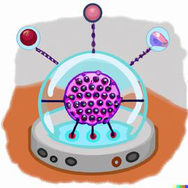

# Squid Control

The Squid Control software is a Python package that provides a simple interface to control the Squid microscope. The software is designed to be used with the Squid microscope (made by Cephla Inc.).

## Installation and Usage

### Quick Start

**Install from source (recommended for development)**
```bash
# Clone the repository
git clone https://github.com/aicell-lab/squid-control.git
cd squid-control

# Install in development mode
pip install -e .[dev]
```

**Full installation (including tracking):**
```bash
pip install .[all]
```

### Dependency Management

All dependencies are managed through `pyproject.toml` with the following benefits:

- **Version Compatibility**: Dependencies are carefully versioned to avoid conflicts
- **Optional Dependencies**: Install only what you need
- **Modern Standards**: Uses PEP 621 compliant dependency specification
- **Build System**: Standardized build process with setuptools

### Usage

**Command Line Interface:**

The Squid Control system provides a unified command-line interface with subcommands:

```bash
# Main microscope service
python -m squid_control microscope [--simulation] [--local] [--verbose]

# Mirror service for cloud-to-local proxy
python -m squid_control mirror [--cloud-service-id ID] [--local-service-id ID] [--verbose]

# Examples:
# Run microscope in simulation mode
python -m squid_control microscope --simulation

# Run microscope in local mode
python -m squid_control microscope --local

# Run microscope with verbose logging
python -m squid_control microscope --simulation --verbose

# Run mirror service with custom service IDs
python -m squid_control mirror \
  --cloud-service-id "mirror-microscope-control-squid-2" \
  --local-service-id "microscope-control-squid-2"

# Get help
python -m squid_control --help
python -m squid_control microscope --help
python -m squid_control mirror --help
```

### Environment Setup

For development, we recommend using conda:

```bash
# Create conda environment
conda create -n squid python=3.11

# Activate environment
conda activate squid

# Install in development mode
pip install -e .[dev]
```

### Simulation Mode

To start simulation mode, use the following command:
```bash
python -m squid_control microscope --simulation
```

#### Simulated Sample (Zarr-based Virtual Sample)

The simulation mode includes a **virtual microscope sample** using Zarr data archives. This allows you to test the microscope software without a physical sample. The simulated camera retrieves image data based on the current stage position, applies exposure and intensity adjustments, and returns realistic microscopy images.

- The simulated sample consists of Zarr data stored in ZIP files containing high-resolution microscopy images.
- The `Camera_Simulation` class (in `camera_default.py`) handles simulated image acquisition.
- The `ZarrImageManager` retrieves image data from the Zarr archives, either by direct array access or by assembling the region from smaller chunks.
- The image is processed with the requested exposure time, intensity, and optional Z-blurring, then returned to the user.

#### Simulated Sample Features:
- Supports different imaging channels (brightfield and fluorescence)
- Adjustable exposure time and intensity
- Realistic Z-axis blurring for out-of-focus images
- High-resolution sample data covering the stage area

## Mirror Service

The **Mirror Service** is a sophisticated proxy system that bridges cloud and local microscope control systems, enabling remote control of microscopes while maintaining full WebRTC video streaming capabilities.

### How to Use Mirror Service

```bash
# Run mirror service with default settings
python -m squid_control mirror

# Run with custom service IDs
python -m squid_control mirror \
  --cloud-service-id "mirror-microscope-control-squid-2" \
  --local-service-id "microscope-control-squid-2"

# Run with custom server URLs
python -m squid_control mirror \
  --cloud-server-url "https://hypha.aicell.io" \
  --cloud-workspace "reef-imaging" \
  --local-server-url "http://localhost:9527" \
  --local-service-id "microscope-control-squid-1"
```

### Mirror Service Features

- **Dynamic Method Mirroring**: Automatically mirrors all available methods from local services to cloud
- **WebRTC Video Streaming**: Real-time video with metadata transmission via data channels
- **Health Monitoring**: Automatic health checks with exponential backoff reconnection
- **Configurable Service IDs**: Customizable cloud and local service identifiers
- **Automatic Illumination Control**: Manages illumination based on WebRTC connection state

## Zarr Canvas & Image Stitching

The Squid Control system features advanced **Zarr Canvas & Image Stitching** capabilities that enable real-time creation of large field-of-view images from multiple microscope acquisitions. This system provides both normal scanning and quick scanning modes with automatic well-based organization.

### Key Features

#### **Multi-Scale Canvas Architecture**
- **OME-Zarr Compliance**: Full OME-Zarr 0.4 specification support with proper metadata
- **Pyramid Structure**: Multi-scale pyramid with 4x downsampling between levels (scale0=full, scale1=1/4, scale2=1/16, etc.)
- **Optimized Chunking**: 256x256 pixel chunks for efficient I/O performance
- **Memory Efficiency**: Lazy loading and background processing for large datasets

#### **Well-Based Experiment Management**
- **Individual Well Canvases**: Each well gets its own zarr canvas for precise control
- **Experiment Organization**: Hierarchical structure with experiments containing multiple well canvases
- **Automatic Well Detection**: System automatically determines which well contains the current stage position
- **Well-Relative Coordinates**: Each well canvas uses well-center-relative coordinate system

#### **Scanning Modes**

**Normal Scan with Stitching:**
- Grid-based scanning with configurable spacing
- Multi-channel support (brightfield and fluorescence)
- Autofocus integration (contrast and reflection-based)
- Snake pattern scanning for efficiency
- Real-time stitching to OME-Zarr format

**Quick Scan with Stitching:**
- High-speed continuous scanning (up to 10fps)
- Brightfield-only mode with exposure ≤ 30ms
- 4-stripe pattern per well for comprehensive coverage
- Optimized for performance with scale1-5 updates only

#### **Experiment Management**
- **Create Experiments**: Organize scans into named experiments
- **List Experiments**: View all available experiments and their status
- **Set Active Experiment**: Switch between experiments for data collection
- **Remove/Reset Experiments**: Clean up or reset experiment data
- **Experiment Info**: Detailed information about experiment size and contents

### Technical Architecture

#### **ZarrCanvas Classes**
- **`WellZarrCanvasBase`**: Core stitching functionality with OME-Zarr compliance
- **`WellZarrCanvas`**: Well-specific implementation with automatic coordinate conversion
- **`ExperimentManager`**: Manages experiment folders and well canvas lifecycle

#### **Performance Optimizations**
- **Background Stitching**: Non-blocking frame processing with asyncio queues
- **Thread Safety**: RLock-based concurrent access to zarr arrays
- **Memory Management**: Automatic cleanup and resource management
- **Quick Scan Mode**: Optimized for high-speed acquisition with selective scale updates

#### **Data Formats**
- **Input**: Real-time microscope frames with stage position metadata
- **Storage**: OME-Zarr format with multi-scale pyramid structure
- **Output**: Base64 PNG or numpy arrays for flexible integration
- **Metadata**: Comprehensive channel mapping and coordinate transformation data

### Configuration

#### **Environment Variables**
- `ZARR_PATH`: Base directory for zarr storage (default: `/tmp/zarr_canvas`)

#### **Well Plate Support**
- **Supported Formats**: 6, 12, 24, 96, 384 well plates
- **Well Naming**: Row letters (A-H) + Column numbers (1-12)
- **Padding**: Configurable padding around each well (default: 2.0mm)

## Troubleshooting

If you encounter dependency conflicts:

1. **Clean Environment**: Create a fresh virtual environment
2. **Update pip**: `pip install --upgrade pip`
3. **Install with extras**: Use specific optional dependency groups
4. **Check Python Version**: Ensure you're using Python 3.8+

### Common Issues

**Command not found errors:**
- Make sure you're using the correct subcommand format: `python -m squid_control microscope --simulation`
- Don't use flags without subcommands: `python -m squid_control --simulation` (will fail)

**Service connection issues:**
- Check network connectivity for cloud services
- Verify local server URLs and ports
- Ensure proper authentication tokens are set

## Version Constraints

The project uses semantic versioning constraints:
- `>=X.Y.Z,<A.B.C`: Accepts versions from X.Y.Z up to (but not including) A.B.C
- This ensures compatibility while allowing security updates
- Major version changes are explicitly controlled to prevent breaking changes

---

## About

 AICell Lab  
 Cephla Inc.

---

## Note

The current branch is a fork from https://github.com/hongquanli/octopi-research/ at the following commit:
```
commit dbb49fc314d82d8099d5e509c0e1ad9a919245c9 (HEAD -> master, origin/master, origin/HEAD)
Author: Hongquan Li <hqlisu@gmail.com>
Date:   Thu Apr 4 18:07:51 2024 -0700
    add laser af characterization mode for saving images from laser af camera
```

How to make pypi work:
 - Register on pypi.org
 - Create a new token in the account settings
 - In the repository setting, create a new secret called `PYPI_API_TOKEN` and paste the token in the value field
 - Then, if you want to manually publish a new pypi package, go to actions, select the `Publish to PyPi` workflow, and click on `Run workflow`.

