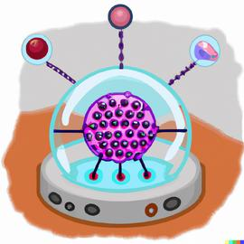

# Squid Control

**Squid Control** is a Python package for operating the [Squid microscope](https://www.cephla.com/) (by Cephla Inc.). It provides a complete software stack for microscope hardware control, remote access via the [Hypha platform](https://hypha.aicell.io/), real-time video streaming, automated well plate scanning, and multi-channel fluorescence imaging.

<table>
<tr>
<td></td>
<td><strong>AICell Lab</strong></td>
<td></td>
<td><strong>Cephla Inc.</strong></td>
</tr>
</table>

---

## What It Does

| Capability | Description |
|-----------|-------------|
| **Hardware control** | Stage X/Y/Z, multi-channel LED illumination, camera triggering via Teensy 4.1 microcontroller |
| **Remote API** | Full microscope control over the internet via Hypha RPC (WebSocket + WebRTC) |
| **Live video** | WebRTC streaming of the microscope camera feed to any web browser |
| **Well plate scanning** | Automated multi-well, multi-channel, multi-Z acquisition for 6–384 well plates |
| **Image stitching** | Real-time OME-Zarr tile assembly with multi-scale pyramid output |
| **Simulation mode** | Full software simulation using real Zarr sample data — no hardware required |
| **Mirror service** | Cloud proxy that gives public remote access to a microscope behind a firewall |

---

## Installation

**Requirements:** Python 3.11+, conda recommended.

```bash
git clone https://github.com/aicell-lab/squid-control.git
cd squid-control

conda create -n squid python=3.11
conda activate squid

pip install -e .[dev]
```

---

## Quick Start

### Simulation mode (no hardware needed)

```bash
python -m squid_control microscope --simulation
```

This starts the full Hypha service with a virtual microscope. Sample images are streamed from Zarr archives hosted on the Hypha platform.

### Hardware mode

```bash
python -m squid_control microscope
```

Connects to the Teensy 4.1 microcontroller over USB and registers the microscope on the Hypha `reef-imaging` workspace.

### Local mode (private server)

```bash
python -m squid_control microscope --local
```

Registers the service on a local Hypha server instead of the public cloud.

### Mirror service (remote access through firewall)

```bash
python -m squid_control mirror \
  --local-service-id "microscope-control-squid-1" \
  --cloud-service-id "microscope-control-squid-1"
```

Bridges a local microscope service to the public Hypha cloud, enabling remote access while keeping hardware control local.

---

## Environment Variables

| Variable | Description |
|----------|-------------|
| `REEF_WORKSPACE_TOKEN` | Authentication token for the `reef-imaging` Hypha workspace |
| `REEF_LOCAL_TOKEN` | Token for a private local Hypha server |
| `REEF_LOCAL_WORKSPACE` | Workspace name on the local Hypha server |
| `SQUID_CONFIG_PATH` | Absolute path to a custom `.ini` configuration file |

Copy `.env.example` to `.env` and fill in your tokens before running.

---

## Configuration

Hardware parameters are stored in INI files. Three profiles are included:

| Profile | Description |
|---------|-------------|
| `HCS_v2` | Standard setup — 20× objective, HCS well plate stage |
| `HCS_v2_63x` | High-magnification — 63× oil immersion objective |
| `Squid+` | Extended — motorised filter wheel and objective switcher |

```bash
# Use a specific config
python -m squid_control microscope --config HCS_v2_63x
```

---

## Package Structure

The `squid_control` package is organised into focused subpackages:

```
squid_control/
├── controller/    High-level microscope logic (SquidController)
├── hardware/      Hardware drivers — camera, microcontroller, stage
├── service/       Hypha RPC service and WebRTC video streaming
├── mirror/        Cloud proxy for remote access
├── stitching/     OME-Zarr image stitching and canvas management
├── storage/       Artifact upload and snapshot management
├── simulation/    Virtual sample data for simulation mode
└── utils/         Shared utilities — logging, video, image processing
```

See [`squid_control/README.md`](squid_control/README.md) for a full developer reference with class descriptions, method tables, and contribution guides.

---

## Testing

```bash
# Fast tests — simulation only, no network
pytest -m "not integration"

# All tests including cloud integration (requires REEF_WORKSPACE_TOKEN)
pytest

# Specific suites
pytest tests/test_squid_controller.py   # Controller and simulation
pytest tests/test_hypha_service.py      # RPC API endpoints
pytest tests/test_webrtc_e2e.py         # End-to-end video streaming
pytest tests/test_mirror_service.py     # Mirror service
```

---

## Mirror Service — How It Works

The public Hypha server may not always be suitable for critical hardware control. The mirror service solves this:

```
[Web browser / remote client]
         │  WebRTC + RPC
         ▼
[hypha.aicell.io  –  cloud Hypha]
         │  RPC forwarding
         ▼
[Mirror service  –  running on microscope workstation]
         │  local RPC
         ▼
[Local Hypha server  –  stable, on your workstation]
         │
         ▼
[Microscope hardware]
```

1. Local Hypha server runs on the workstation — hardware control is always stable
2. Mirror service connects both to local and cloud servers
3. All microscope methods are automatically proxied to the cloud
4. Remote clients interact with the cloud service — latency-tolerant operations only

---

## Video Streaming

Live microscope video is delivered over WebRTC:

- **Source:** `MicroscopeVideoTrack` — pulls frames from the camera at configurable FPS
- **Buffering:** A background task pre-fetches frames into a ring buffer, decoupling slow acquisition from smooth playback
- **Metadata:** Stage position and channel info are sent via WebRTC data channels alongside video
- **Idle shutdown:** Buffering automatically stops after 5 seconds with no active viewers

---

## Image Stitching

Well plate scans produce OME-Zarr datasets assembled in real time:

- **Format:** OME-Zarr 0.4, axes T/C/Z/Y/X, 4× downsampling between scales
- **Per-well canvases:** Each well gets an independent `ZarrCanvas`
- **Quick scan mode:** Continuous-motion acquisition at up to 10 fps, stitched on the fly
- **Export:** Canvas exported as ZIP archive, uploadable to Hypha Artifact Manager

---

## Simulation Mode — Details

Simulation requires no physical hardware. The virtual microscope:

- Serves real microscopy images cropped from Zarr archives (hosted on Hypha)
- Simulates exposure time and illumination intensity effects
- Applies Gaussian blur proportional to Z-offset for realistic focus behaviour
- Falls back to example images if network is unavailable

```bash
python -m squid_control microscope --simulation
```

---

## Troubleshooting

**SSHFS permission denied in Python threads:** When mounting a remote disk via SSHFS, add the `allow_other` option and ensure `user_allow_other` is enabled in `/etc/fuse.conf`:

```bash
sshfs user@host:/remote/path /local/mount -o allow_other
```

---

## Fork Notice

This repository is a fork of [octopi-research](https://github.com/hongquanli/octopi-research) by Hongquan Li, extended with Hypha integration, WebRTC streaming, Zarr stitching, simulation mode, and a cloud mirror service.
